# Comptia A+ Core 1  

## Fundamentals  
* b means bit, B means bytes. 
	- So 200 Mbps = 200,000,000 bits per second
	- 4 MB = 4,000,000 B x 8 bits = 32,000,000 bits  
* **Throughput unit** 
	- Kbps, Mbps, Gbps, Tbps all per second    
* **Processing Speed**  
	- Frequency of electrical cycles per second
	- MHz, GHz  
* Devices  
	- The old mouse and keyboard connection to computers (round with pins) was called a PS2 connection  
	- CMOS = BIOS chip  
	- Chipset: directs the communication between the processor and rame  
* Storage types  
	- Local Network  
		- NAS - Network Attached Storage  
		- File Server 
		- Local Cloud
	- Remote Network  
		- Cloud 
## Mobile Devices  
**RTM** - read the manual. This is per device, for maintenance.  
* Digitizer - like a signing pad, takes a written representation and puts it into a digital format  

### Displays  
* LCD - Liquid Crystal Display  
	- It doesn't produce light  
	- Uses a backlight
		- Cold Cathode Fluorescent Lamp (CCFL)  
	- Inverter
		- Converts DC to AC for the backlight  
		- If there is a problem with flickering or dimness it might be the inverter  
	- Display technology 
		- Twisted nematic (TN)
			- very old
			- good response time  
			- very little lag, high refresh rate, 240 Hz  
			- Bad at angles  
		- In-plane switching (IPS)  
			- Great color  
			- Good view angles  
			- Little lag  
		- Vertical alignment (VA) 
			- Great Color  
			- Okay Response  
		- Organic light-emitting diode (OLED)
			- Light-emitting compound  
			- There is no need for a backlight 
				- Which means that it can have a dark black color  
			- Contrast ratio of OLED displays exceeds that of LCD  
			- OLED is highest quality  
			- Found in smaller devices  
### Device Accessories  
* Port replicator - reproduces the functions of the ports. (Looks like a usb hub to me)  
	- Will have usb, display (HDMI, DP, VGA), or ethernet connection
* Docking station - similar to port replicator but can have a full drive bay, optical drives, memory card slots  
* RAM
	- SODIMM - most laptops use Small Outline Dual in-line Memory Modules
### Connection methods  
* USB - universal serial bus
	- c / microUSB/ miniUSB  
* Bluetooth - 30ft range  
* NFC - 4cm range  
	
### Bluetooth and MDM 
* Mobile Device Management(MDM)/ Mobile Application Management (MAM)  

### Cellular Standards  
* xG - The G stands for generation  
* 2G - handle phone calls, SMS, and limited data
	- GSM (GLobal System for Mobile Communication)
		- used by AT&T and T-Mobile  
		- The US and the rest of the world used GSM
	- CDMA (Code-Driven multiple acces)  
		- used by Sprint and Verizon
		- Uses preferred roaming list (PRL)
			- Required contiunous updates with PRL to establish communications
	- GSM and CDMA were not compatible with eachother
* 3G - allows additional features such as mobile Internet access, video calls and modile TV  
* 4G 
	- WIMAX and Long-Term Evolution (LTE) where 2 standards, LTE won.  
	- Faster than 3G, Theoretical max is 300Mbps down and 75 Mbps Up.
	- No need for GSM or CDMA  
	- One standard  
* 5G
	- 100x faster than 4G  
	- May hit speeds of 20Gbps  
	- Low-latency links (Connects very fast between devices)
	
### Data Synchronization  

## Networking  
### Protocols  
* TCP/IP 
	- Made of many protocols like HTTP and FTP
* TCP - connection oriented Protocol  
	- In the applications and network layers of OSI
	- Keeps tract of the segments being transmitted or received by assigning numbers to every single one  
	- Flow control limits the rate of data transfer to ensure reliability  
	- It won't load the whole page if a single piece of the data is missing  
	- 24-60 bytes (high overhead)
* UDP - User Datagram Protocol, is connectionless and unreliable but fast  
	- Used for smaller data sized transfers
	- Suitable for milticasting and packet switching  
	- Used for real-time applications  
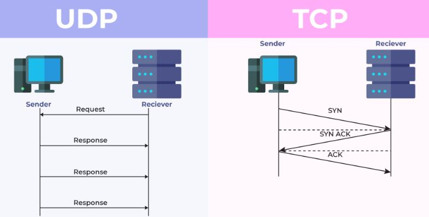

### Ports  
* 65,535 ports on a computer  
* File Transfer Protocol - FTP
	- share files over a LAN or WAN  
	- TCP port 20 and 21  
	- Supports authentication, authorization, and directory browsing  
	- Unencrypted. Should use SFTP 
	- **FileZilla** application for FTP  
* Trivial File Transfer Protocol  
	- Used to push or pull files from a server  
	- Commonly used to manage devices like IP phones, routers, switches  
	- DOES NOT SUPPORT authentication, authorization, or diretory browsing  
	- UDP port 69  
	- Unencrypted, use SFTP
* Secure File Transfer Protocol  
	- Secure version of FTP  
	- has encryption  
	- SFTP is an extension of SSH which is shy they use the same port number  
	- TCP Port 22  
* Simple Mail Transfer Protocol  
	- outgoing mail to a server  
	- TCP Port 25  
* Post Office Protocol (POP3)  
	- Downloads incoming mail from server  
	- TCP port 110  
* Internet Message Access Protocol (IMAP)  
	- synchronizes incoming mail from a server  
	- TCP port 143  
* Telnet  
	- provides remote command line acces to interact with a server  
	- Considered insecure and should no longer be used, use SSH instead  
	- TCP port 23  
	- More common on Linux  
* SSH - Secure Shell 
	- provides encrypted remote command line access to interact with a server  
	- SSH Version 2 added SFTP and SCP support 
	- TCP port 22  
	- **PuTTY** is the application used  
* DNS 
	- TCP/UDP port 53  
* DHCP - Dynamic Host Configuration Protocol  
	- provides various configurations to clients in an IP network via broadcast  
	- UDP port 67 is the server port, and 68 is the client port  
* HTTP
	- TCP port 80
* HTTPS
	- securely transfers using SSL or TLS  
	- TCP port 443  
* NetBIOS  
	- Network Basic Input/Output System provides communications in Windows Network 
	- Used in Windows before IP networking  
	- NetBIOS over TCP/IP is still used in Windows  
	- TCP/UDP  port 137/139  
* SNMP - Simple Network Management Protocol
	- used to query, configure, and monitor host in LAN  
	- SNMPv3 encrypts communication where previous versions did not  
	- UDP port 161/162  
* LDAP - Lightweight Directory Access Protocol 
	- used in domain-based network environments to facilitate system and user management  
	- TCP/UDP port 389  
* Server Message Block (SMB)
	- file sharing, network browsing, print services  
	- Commonly used in Windows networks but supported in Linux and MacOS  
	- CIFS(Common Internet File System) is an open implementation used on Linux and macOS  
	- TCP port 445  
* RDP - Remote Desktop Protocol  
	- securely access Windows desktop  
	- TCP port 3389  
	
### TCP vs UDP  
* TCP  
	- TCP Segment  
		- 24-60 bytes  
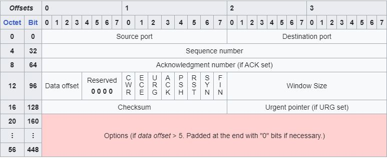 
		- Connection-oriented  
		- Virtual Circuit  
		- Sequenced  
* UDP segment  
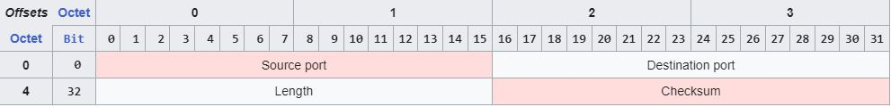  
	- 8 bytes, lightweight  
	- un-sequenced  
	- no virtual circuit  
	- connectionless  

### Networking Devices  
* NIC - Network Interface Card  
	- connect to the network  
	- each one has a 48-bit MAC address 
	- The link light and activity lights are used to troubleshoot connections made to the NIC  
		- **Link light** verifes the cable is plugged in. It is the light on the left.  
		- **Activity Light** will blink as data goes throught he interface  
* Hubs - not used anymore because it broadcast to every port.  There were data collisions 
* Switch 
	- replaces hub  
	- used to connect and manage wired communications in a LAN  
		- Forward frames based on MAC addresses  
		- Managed switch vs unmanaged switch  
			- Managed switches can be configured
				- used in enterprise LANs to meet their needs for enforcing policies  
				- Provide additional functions like VLANs, port security, DHCP snooping, and dynamic ARP inspection  
				- expensive  
			- Unmanaged switches cannot be configured  
				- used in SOHO networks  
				- Lower cost  
* Router 
	- used to connect different broadcast domains to eachother  
	- Commonly used to connect a LAN to a WAN (site to site or the Internet)  
	- Forwards traffice based on IP Address in packets  
	- Can usuall provide DHCP  
* Firewall
	- Security device used to prevent authorized access to a LAN from the Internet  
	- can be hardware appliance or host-based software  
* Access Point (AP)  
	- used to provide and manage wireless communications in a LAN 
	- Uses Radio Frequencies (RF) to transmit data to the host  
* SOHO Router (Small office, Home office)
	- multifunction device offering many features beyond routing  
	- Includes: wireless, switching, firewall, security, and DHCP  
	- Can include: content filtering, file server, print server, VPN client and server, and other features  
	- Forwards traffic based on IP Addresses in packets  
	
* Power over Ethernet (PoE)  
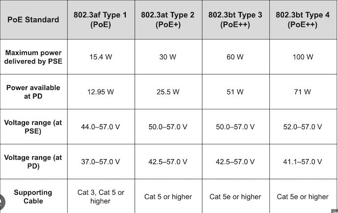
	- Requires a dedicated PoE switch, or else you can use a PoE Injector  
	- Allows you to power devices using just an Ethernet cable 
* DSL - digital subscriber line  
	- used over telephone lines  
* ONT - Optical Network Terminal
	- converts optical signal from fiber  
* Software-defined networking (SND)  
	- SDN Controller in the control plane directs communications between devices in the data plane  

### Join wireless networks

### 2.4 GHZ vs 5 GHz  
* 2.4 GHz Spectrum  
	- Long range communication, better penetration through barriers
	- Slower than 5 GHz  
	- Higher rate of interference because of long range  
	- 11 channels in total  
	- Non-overlapping channels 1, 6, 11 offer the best chance of minimizing interference  
* 5 GHz Spectrum  
	- Short range, poor penetration  
	- Faster data rate  
	- 45 channels, 24 non-overlapping  
	- 20 MHz uses 36, 40, 44, 48, 149, 153, 157, 161, 165  
	- 40 MHz uses 38, 46, 151, 159  
	- Low chance of interference because of its shorter range  
	
### Wifi Standards  
* WIFI 4  and up supports MIMO (Multiple in, Multiple Out)  
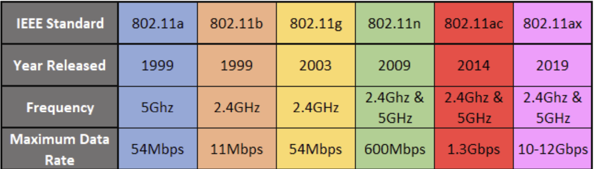  

### WIFI Considerations  
* SSID (sevice Set Identifier)  
	- name of the wifi network  
	- always change the default name  
* IP Address - set a static IP for administration  
* change default username and password  
* Long-Range fixed wireless  
	- used to connect wireless devices over miles  
	- Usually installed using point-to-point directional antennas  
	- May have to go to the FCC to et a license for the radio frequency  
* RFID (Radio-frequency identification) 
	- uses electromagnetic fields to automatically identify and track tags attached to objects  
	- used in access cards, ez-pass, or inventory management  

### Types of servers  
* DNS - translate domain name to IP address  
* DHCP - gives out IP address on a network  
* Fileshare - sshares files and folders on network  
* Print Servers  
* Mail Servers  
* Syslog - Recieves logs from devices in network  
* Web Servers  

### Internet Appliances  
* Spam Gateways - keeps spam from entering emails  
* Unified Threat Management (UTM)  
	- A combination of antimalware, firewall and intrusion detection system  
* Load Balancers - allow multiple servers served the same amount of traffic  
* Proxy Servers  
	- Request webpages on behalf of users  
	- Can be used to filter out web traffic, such as blocking users from seeing Facebook  
* SCADA (Supervisory control and data acquisition)  
	- Older utility systems such as providing gas and electric power  
	- May have to be sectioned off from the network to ensure no access  
	- Embedded/Legacy systems  

### Convert binary 
* Write out 8 bits  
* Put the 0 and 1 underneath each of the bits  
* 255 is the max of 8 bits  

### IPv4 address  
* IPv4 is 32 bits, 4 values of 255 max  
	- the first 8 bits can only go up to 223 (the far left one)  
* The IANA gives out blocks of IP addresses to ISPs

### Network Classes  
* the first 8 bits max at 223 because of class D an E below  
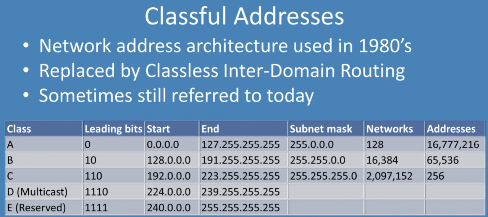  

### Figuring out the Network ID  
Take the IP address, put it over the subnet mask. If the IP is above 255, use the IP number, if the subnet mask is 0, use the 0.  
- EX: IP = 192.168.30.10  
Subnet Mask = 255.255.255.0  
Network ID is = 192.168.30.0   
* Computers with the same Network ID are on the same switch (possibly) and can talk to eachother  
* Devices with different Network IDs will need a router to communicate  
* Default Gateway - the IP address used by the switch to communicate to devices outside of the switch  

### Private IP addresses   
* Public IP - connect to the internet, given out by ISP  
* Private IP - designated to only be used internally
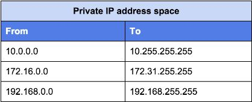  

### CIDR - Classless Inter-Domain Routing  
EX: 192.168.30.4/24 => subnet mask of 255.255.255.0 (Class C)  
EX: 192.168.30.4/16 => subnet mask of 255.255.0.0 (Class B)  
EX: 192.168.30.4/8 => subnet mask of 255.0.0.0 (Class A)  
* Lets you know what the subnet mask is for an IP address  
* **Network IP** - 192.168.30.0/24, so 192.168.30.0, the first IP, is reserved for the Network IP  
* **Broadcast IP** - 192.168.30.255, the last IP, is reserved for Broadcast IP  
Another EX: 172.30.6.4/16  
Network IP = 172.30.0.0  
Broadcast IP = 172.30.255.255  
* Know the difference betwee Networks and hosts. The higher the CIDR number the more Networks that can be assigned the IP but fewer hosts. The lower the CIDR the fewer networks but more Hosts in the IP.  

### Communication with IP  
* Unicast - one to one communication  
	- **Public IP**: routable IP addresses assigned by an ISP.  
	- **Private IP**: Non-routable IP address.  
	- **APIPA**: Automatic private IP address self assigned by a host when DHCP is not available  
		- IP ranges 169.254.0.0 - 239.255.255.255 
		- Usually an error, the computer tried getting an IP from a DHCP server, but none was returned, so the computer creates its own IP address in this range  
		- The device won't have internet access and won't find any server files  
* Multicast: One to many communication  
	- IP ranges 224.0.0.0 - 239.255.255.255 
	- Like for sending an update out to a set of devices   
* Broadcast (Layer 3): One to everyone  
	- IP ranges 192.168.30.255/24  
* Loopback(localhost): used for a host to communicate with itself  
	- IP ranges 127.0.0.0 - 127.255.255.255  
	- Loopback means talk to my own computer, just the same as pinging my own IP  
	- Used to test a local software.  

### IPv6  
* 8 fields of 16 bit blocks using Hex  
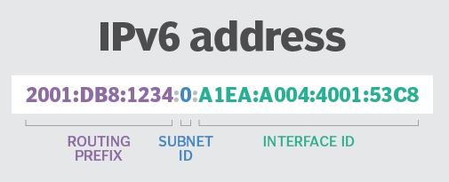  
* 128 bits   
* Prefix is the first 64 bits, assigned to an organization  
	- The first 3 fields are the **Global routing prefix**  
	- The fourth is the **Subnet-ID**  
* Interface-ID: Last 64 bits of an IPv6 address and is used to identigy a unique interface on a host  
* Condensing the IPv6  
	- get rid of leading 0s  
	- Condense several 0s to just one 0  
	- Can remove single groups of 0 all together and just have '::', but this can only occur once  
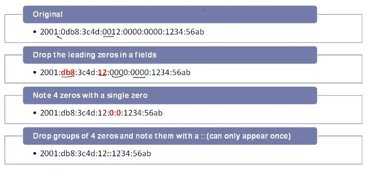  

### Types of IPv6  
* **Unicast**: One to one, packet is sent to a single interface.  
	- Global Unicast Address: publicly routable addresses used to communicate outside of a local network.  
		- 2000::/3 was originally defined address space, but now all "non-defined" addresses are condsidered global unicast addresses.  
	- Unique Local Addresses: non-publicly routable addresses used to communicate with-in a local network.  
		- FC00::/7 but the 8th bit must always be enabled so FD00/8 is the actual useable defined space.  
	- Link-Local addresses: replacement for Automatic Private IP Addresses (APIPA),  
		- Every IPV6 host will have a link-local address  
		- FE80::/10 
		- Self assigned by the computer, could not connect to the DHCP server  
* **Multicast**: One to may, packet is sent to may interfaces  
	- FF00::/8 is the defined space for all IPv6 multicast  
* **Loopback**: Used for testing, ::1  
* **Anycast**: Ont to nearest, packet is sent to the nearest interface in terms of routing distance. Replaces bradcast from IPv4  

### DHCP - Dynamic Host Configuration Protocol  
* Scope: is the range of addresses the server can assign  
* Exclusion Range: is the range of addresses the server can not assign  
* Reservations: allow you to bind a MAC address to a specific IP address  
	- Allow DHCP to consistently assign the same IP address to a device without having to manually configure a static IP address  
* Lease Time: defines how long an IP address is "owned" by a host before it can be assigned to another host.   
	- Available leases: identify how many addresses are still available from teh scope  
	
### DNS - Domain Name Service  
* Types:
	- Host names: identify a specific device in a network  
		- Hostname = workstation01  
	- Domain names: identify a specific network  
		- Domain name = companyx.lan  
	- Fully Qualified Domain Name (FQDN): identify a specific in a specific network  
		- FQDN = workstation01.companyx.lan  
* DNS are record based  
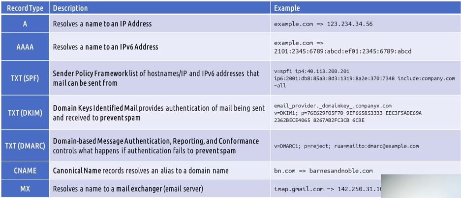  
	- CNAME: can give other aliases to a domain name  
	- SPF: prevent some one from setting up a fake email account  
	- DKIM: authentication token that can be used to filter out spam  
	
### VPN & VLAN
Various Protocols for VPN  
	- PPTP, L2TP, IPSec, OpenVPN, SSL-VPN  
* Required to acces LAN over the Internet  

VLAN - created at Layer 2 on a Switch 
* Separates ports on a switch, logically   

### Internet Connection Types  
* DSL (Digital Service Line)  
	- runs on traditional phone lines (PSTN - Public Switched Telephone Network)    
	- Uses a DSL modem or DSL filter/splitter (prevent noise when connecting to a telephone to a DSL line)  
* Cable  
	- Uses DOCSIS (Data OVer Cable Service Internet Specification)  
	- Described in FTTN (Fiber to the Node) service  
	- Requires a Cabel Modem  
* Fiber: over fiber optic cable  
	- FIOS(Fiber Optic Service) are FTTP(Fiber to the PRemise)  
	- Fastest service but also the most expensive  
	- Requires: ONT(Optical Network Transceiver) to convert the fiber cable from provider to twisted pair to connect to router  
* Satellite  
	- Requirements:  
		- connect to a satellite receiver via coax  
		- clear view to space  
	- suffers from high latency which makes it not good for  
		- VoIP, video streaming, online gaming  
* Cellular  
	- Requirement:  
		- within 4G/LTE or 5G area  
		- Mobile device with a cellular radio installed  
* WISP (Wireleass Internet Service Provider)  
	- provide to small municipalities where cable or fiber is not available  
	- providers use wireless access points deployed and at customer sites  
	- Requirements: must be within coverage area  

### Network Types  
* LAN  
* WLAN - wireless local area network  
* MAN - Metropolitan Area Network  
	- spread across a single city  
	- Connections between the sites are often privately owned and managed by teh organizationa that use them  
* WAN - Wide Area Network  
	- Internet  
	- Site-to-Site connections  
* CAN - Campus Area Network  
* PAN - Personal Area Network  
	- usually made up of two devices  
	- connected via cable or wireless  
	- sending data from phone to computer  
* SAN - Storage Area Network  
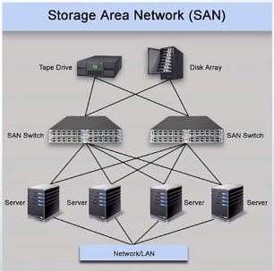  
	- just for storing data  

### Network Tools  
* Crimper for RJ45 or RJ11
* Cable stripper  
* Wireless Analyzer - can use an app on your phone to check wireless signals  
* Toner probe - identifies the other end of a twisted-pair cable  
* Punch-Down Tool: Used for isntalling cables into a patch panel  
* Cable Tester: Test to see if the lines in a cable line up from one connection to another connection  
* Loobpack Plugs: test to see if the port can send an recieve signals  
* Network Tab: inline way to read packes (WireShark?)  
 
 
**Shielded Cat 6** - if an area is losing connection to the internet sporadically due to EMI, this is the most cost efficient way without sacraficing system performance  

## Hardware  

### Network Cables  
*Transmission Speeds  
	- Copper Cable: 40 Gigabits  
	- Fiber Cables: 100 Gigabits

