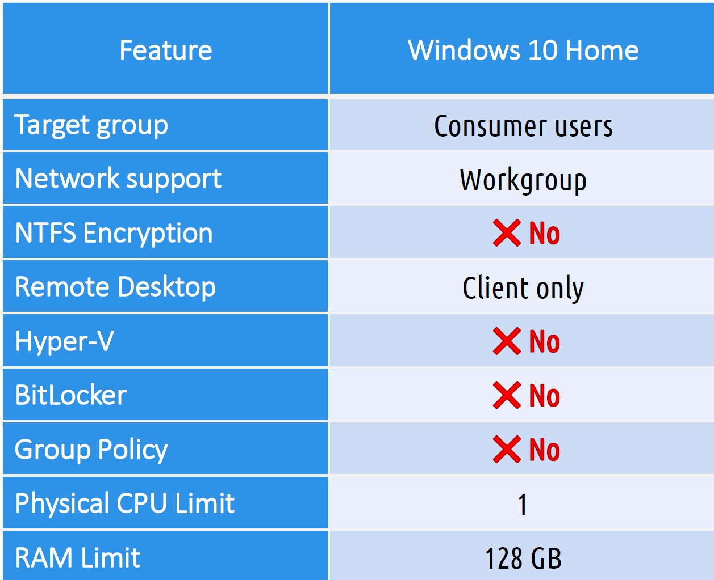
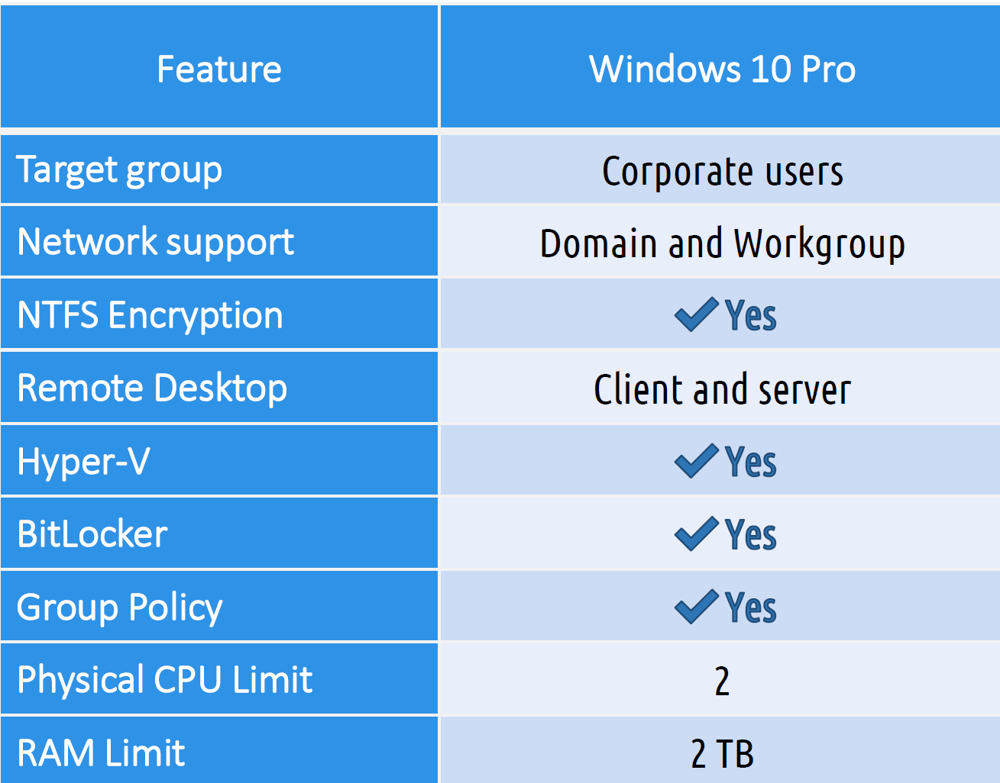
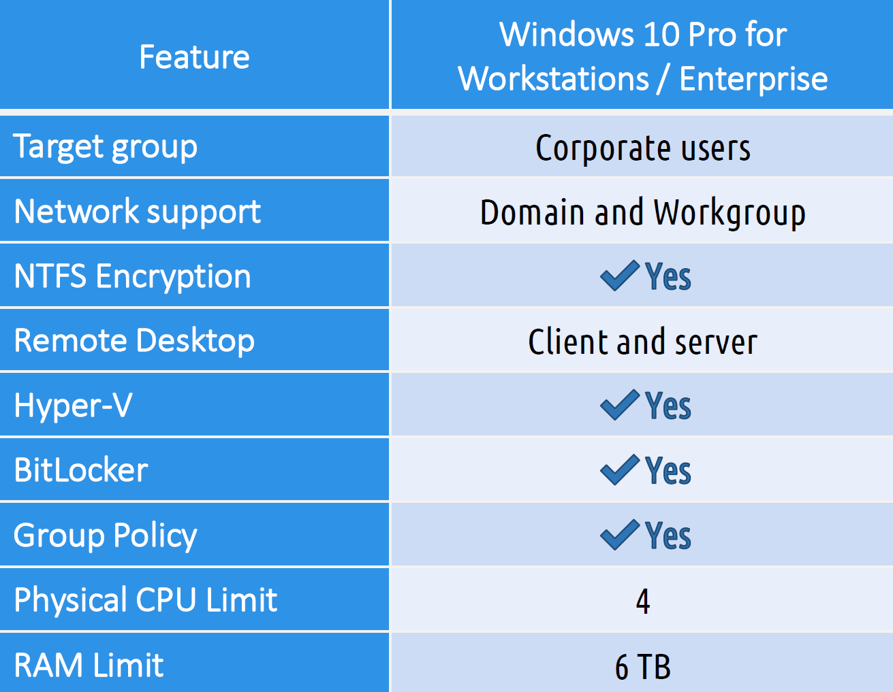

# A+ Part Deux  

## Operating Systems  

- Purposes  
	- File management  
	- Network Connection  
	- Security  
	
- Types: 
	- Closed Source: Windows, only available from one organization  
	- Open Source: Distributed by many organizations  

### Windows Upgrades  

- Must have a previous bootable version of Windows installed  
- Installation media on removable media or stored locally  
- Upgrade paths: 
	- 7 and 8.1 => 10 
		- 8.0 => 8.1 => 10
	- 10 => 11
	- pro 7 => 10  
		- going from professional to home will cause a loss of professional features.  
		- Pro connects to a domain and has more security  

### Windows 10  

- Released in 2015
- Supported until 2035  

| Component | 32-bit | 64-bit |  
| --- | --- | --- |  
| CPU | 1 GHz | 1 GHz |  
| RAM | 1 GB | 2 GB |  
| Storage | 16 GB | 32 GB |  
| Graphics | DirectX 9 or > | DirectX 9 or > |  

Versions:  

  

  

  

### Copy Command  

- `copy` is used to copy files from one folder to another  
- `xcopy` can copy folders, subfolders, and all the files with them  
- `robocopy` is more advanced copy task than xcopy  

### Disk management commands  

- `chkdsk` scans a disk in hopes fo recovering corrupted files  
	- `/f` fixes errors on the disk  
	- `/r` fixes error and locates bad sectors  
- `format` erases a disk file applying a file system  
	- `/fs` specifies the type of the file system (FAT, FAT32, exFATE, NTFS)  
		- `format d: /fs:ntfs` will format the D drive as ntfs  
	- `/q` performs a quick format  
		- `format d: /fs:fat32 /q` performs a quick format on the D drive as fat32  
- `convert` changes FAT/FAT32 filesystem to NTFS without erasing files  
	- `/fs` specifies that the volume will be converted to NTFS.
	- **Cannot convert NTFS to any other file system**  
- `diskpart` is a command line partition managemnt tool  

### CMD commands  

- `/?` shows help on a command  
- `cd` or `chdir`  
- `md` or `mkdir`  
- `rd` or `rmdir` 
	- only deletes **Empty** folders  
- `del` delete file  
- `tree`  
- Drive navigation with `C:`  
- `winver` shows windows version  
- `cls` clear screen  

### Network Commands  

- `net use` used to connect to a network share  
	- `net use x: \\servername\sharename`  
	- EX: Add a shared folder, called 'R:'  
	- Create a folder on a host computer, your computer for this. 
	- Right click and folder, go to Sharing // Advanced Sharing, grant permissions to everyone if you want  
		- This will share the folder on the network  
	- Check your hostname with `hostname`  
	- Window key type in `run` 
	- type in `\\hostName`. This will show the shared folder  
	- Give it a drive name with `net use r: \\hostName\sharedFolder`  
	
- `netstat` displays active network connections  
	- `-a` displays all connections, including listening ports  
- `tracert` uses ICMP to return a hop count  
- `net user` used to manage user accounts 
	- `net user userName password /add`
- `pathping` performs a ping and a traceroute at the same time  
- `nslookup` identifies the current DNS server and displays IP Addresses for a provided name  
- `hostname` displays a computer's hostname   

- `ping` uses ICMP to return the status of a unicast  
	- `-n` changes the number of pings sent  
	- `-l` changes the size of the ping packet  
	- `-t` pings continuously  
	- `-4` force an IPv4 ping  
	- `-6` force an IPv6 ping  
	
- `ipconfig` Displays ingerface configurations  
	- `/all` displays more detailed information  
	- `/renew` request configurations from a DHCP server  
	- `/release` removes configurations obtained through DHCP  
	- `/displaydns` displays the local DNS cache  
	- `/flushdns` clears the local DNS cache  

### Disk Tools and the registry  

- Disk Cleanup (clanmgr.exe)  
	- Files in teh Recycle Bin  
	- Temporary Internet files  
	- Downloaded program files  
	- Temporary files  

- Disk Defragment (dfrgui.exe)  
	- Optimize and Defragment Drives (Windows 10)  
	- Defragmenting (HDD) - Bits on a hard disk drive are rearranged so files can be loaded faster.  
		- Defragging a drive too frequently can decrease its lifespan  
	- Trimming (SSD)  
		- Makes sure that the NAND memory chips on an SSD ar worn evenly to mazimize the lifespan of the drive  

- Registry Editor (regedit.exe)  
	- a database that stores all the settings and configurations for Windows and it's appliaitons  
	- the `regedit` command can be used to launch the Registry Editor  
- Registry Keys  
	- HKEY_CLASSES_ROOT: stores file association information  
	- HKEY_USERS: Stores settings that apply to all users  
	- HKEY_CURRENT_USER: Stores settings for he individual users  
	- HKEY_LOCAL_MACHINE: Stores settings for all devices that have been installed or removed form the system  
	- HKEY_CURRENT_CONFIG: Stores settings for individual devices when multiple of the same type of device have been installed  

### Event Viewer (eventvwr.msc)  

Displays logs of timestamped events which can be used to assist with troubleshooting  

- Windows Logs  
	- System: list operating system events  
	- Security: list security events  
	- Application: list application events  
	
- Icons  
	- Red = Error  
	- Yellow = Warning  
	- White = Informational  
	
### Microsoft Managment Console (mmc)  

Put all the management tools in one place.  
Create a custom toolbox of useful utilities referred to as "Snap-ins"  

- Snap-ins are the other consoles that are available elsewhere like the Device Manager or Disk Management  
- `mmc` command can be used to launch the Microsoft Management Console  

- Useful Snap-ins  
	- Disk Management (diskmagmt.msc)  
		- Manage Disk Partitions
	- TaskScheduler (taskschd.msc)
		- Create and schedule tasks to run
	- Device Manager (devmgmt.msc)  
		- Check, update and install device drivers
	- Certified Manager (certmgr.msc)
		- Check and manage certificates installed on a computer
	- Local Users and Groups (lusrmgr.msc)  
		- Create, change and delete users on local computer  
	- Performance Monitor ( perfmon.msc)  
		- Monitor computer performance  
	- Group Policy Editor (gpedit.msc)  
		- Edit local group policy  
	

### System info and Configuration  

System information is for viewing detailed information on system hardware and software  

- `msinfo32` command can be used to launch the System Information utility  
	- Hardware Resources : identify hardware conflicts and addresses  
	- Components: Identify driver details and hardware capabilities  
	- Software Environment: Identify software details  
	
- `msconfig.exe` System Configuration  
	- General: change startup type between Nromal, Selective, or Diagnostic types  
	- Boot: change multiboot order  
	- Services: Enable or disable services  
	- Startup: Links ro the Startup tab in the task manager  
	- Tools: Collection of useful tools  

### Task Manager  

- Processes: 
	- Displays all running processes including background processes  
	- Non-responsive processes can be closed here  
- Performance: Displays performance graphs  
- Users:
	- Displays currently logged-in users  
	- It is possible to log out users in this tab  
- Startup: Disable or enable auto-starting applications  
- `taskmgr` can be used to launch the task manager via a run box  
- Ctrl + Shift + Esc

### Control Panel Options  

Filled with applets  
This covers Windows 10 Control Panel utility  

- Internet Options  
	- Configure default internet browser options  
- Devices and Printers  
	- Add, remove, and administrate printers, scanners, cameras, etc.  
- Programs and Features  
	- Reinstall, uninstall programs and windows features  
- Network and Sharing Center  
	- Check and administer NIC  
- System  
	- Check computer specification, rename computer, join domain or workgroup  
- Windows Defender Firewall
	- Check and change firewall setting. Can open ports.  
- Mail  
	- Add, remove, or repair mailboces. Mostly used by Microsoft Outlook.  
- Sound  
	- Use to setup speaker or mic's on a computer  
- User Accounts  
	- Use to change, add, or remove local user accounts  
- Device Manager  
	- Check if devices are functioning correctly. Update or rollback drivers.
- Indexing Options   
	- Check what is being index on a system  
- Administrative Tools  
	- Set of commonly used utilities to manage the system  
- Ease of Access 
	- Make the system easier to use for persons with disabilities  
- File explorer Options  
	- Show hidden files  
	- Hide extensions  
	- General options  
	- View options  
- Power Options  
	- Hibernate  
	- Power Plans  
	- Sleep/suspend  
	- Standby  
	- Choose what closing the lid does  
	- Turn on fast startup  
	- Universl Serial Bus (USB) selective suspend   

**Hibernate** takes everything on the RAM and stores it on the hard drive  
**Sleep Mode** puts the computer in a very low power mode  

### App Settings  
- Time and Language  
	- Configure time and date, and language used on the computer.  
- Update and Security  
	- Set when updates will be applied to the computer  
- Personalization  
	- Personalization of the system to the user likening such as background 
- Apps  
	- Uninstall applications, change window defaults, and enable or disable windows features  
- Privacy  
	- Set what can be tracked on the system  
- System  
	- Allows you to change display information, sound, and notification setting  
- Devices  
	- Manage Bluetooth, printers, and a mouse  
- Network and internet  
	- Manage and connect new NIC 
- Gaming  
	- Connect Xbox gaming accounts  
- Accounts  
	- Create and link new accounts to the system  
	
### Firewall  

- Block all incoming traffic  
- Allows all outgoing traffic  
- Configure and manage with rules  
- Will need to make an exception to allow certain traffic such as ftp through the firewall  
- Access by searching `Defender`  

### Network Configurations  

- Internet PRotocol addressing scheme  
- DNS settings  
- Subnet mask  
- Gateway  
- Static vs Dynamic  
	- Static is manually typed in by a tchnician, Dynamic is assigned by the DHCP  
	- If no DHCP is available when selecting dynamic, the computer will APIPA address of 169.254.x.x  
- WWAN ( Wireless sidae area network)  
	- Internet access using a wireless connection. Done by using an adapter form a mobile cellular network using tchnologies such as 4G or 5G.  
- Private vs Public Network  
	- When connecting to WIFI, your computer will ask if this is Public or Private. 
	If the WIFI is public, the computer will block sharing and discovery from other computers. 
	Increased security  
- Metered Connection  
	- ISP limits the amount of data allowed. 
	You can tell your computer to not exceed the limit.  

