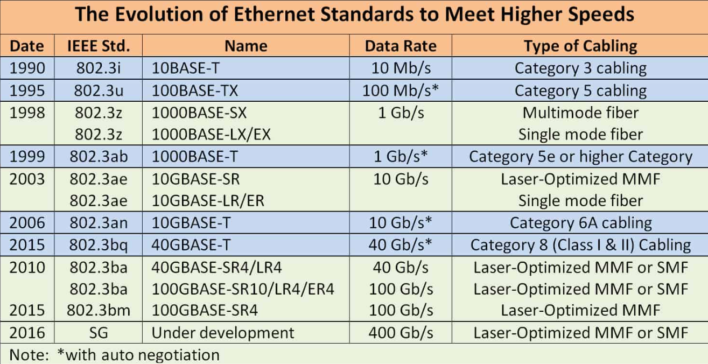
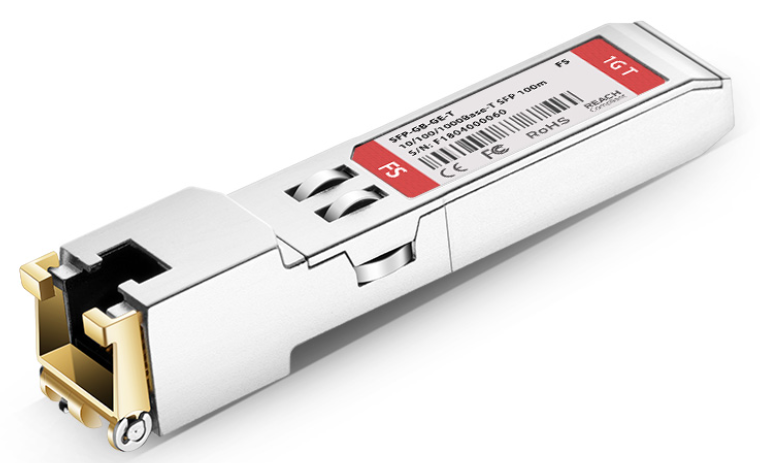
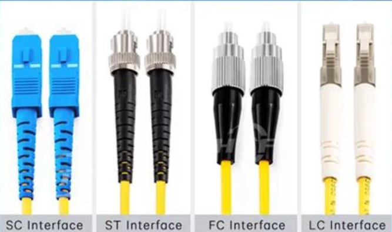
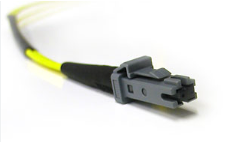
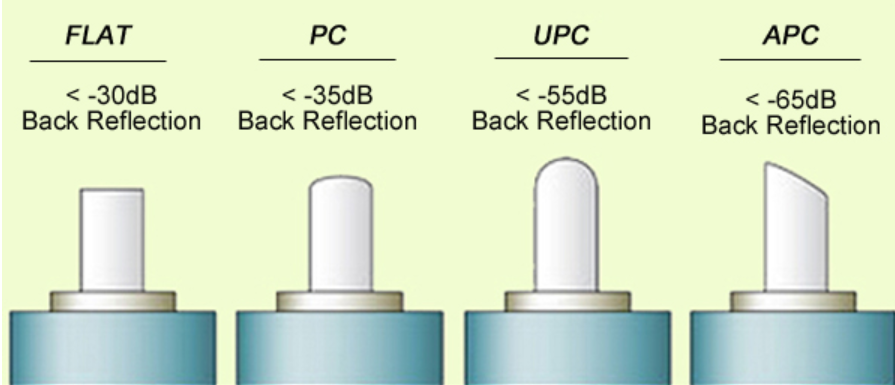
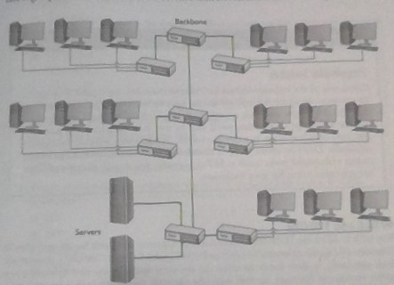

# Open Systems Interconnection (OSI) overview  

**P**lease **D**o **N**ot **T**hrow **S**ausage **P**izza **A**way

| Layer 			|	Attributes				|
| :---				| :---						|
| L7 - Application 	| APIs						|
| L6 - Presentation | Data Conversion			|
| L5 - Session		| Session tracking/naming	| 
| L4 - Transport	| Segmentation/reassembly	|
| L3 - Network		| Router, IP addressing, packets |
| L2 - Data Link	| NIC, Switch, MAC addressing, frames, LLC (Logical Link Control) and MAC (Media Access Control)  |
| L1 - Physical		| Cables, hubs				|  

- A frame encapsulates a packet, packets encapsulate segments

- A general term for encapsulated data in each layer is **protocol data unit** (PDU)  

## Layer 1 - Physical  

## Layer 2 - Data Link

- Anything dealing with the MAC address is part of L2.  

### NIC (Network Interface Card)  

- Mostly part of L2, but is also part of L1 because it is capable of sending 
and receiving physical signals.    

- Contains the Media Access Control (MAC) address. It is burned onto a ROM chip 
on the NIC  

- NIC creates two sublayers inside the L2 Data Link layer: 

	- **Logical Link Control** (LLC): the NIC talks to the operating system, 
	usually through a device driver  
	
	- **Media Access Control** (MAC): creates and addresses the frame.  MAC checks
	the FCS  

### MAC address  

- If is a 48 bit hexadecimal number  

- The first 6 digits are the number assigned to the manufacturer of the NIC.  

- The last 6 digits are the unique serial number to the NIC. This is called 
the **Organizationally Unique Identifier (OUI)**  

- View the physical address, AKA MAC address:

	- Windows `ipconfig /all`  
	
	- Apple ` ifconfig`  
	
	- Linux `ip a`  
	
- MAC-48 is also called EUI-48 by the IEEE, for Extended Unique Identifier  

- **Broadcast address** - `FF-FF-FF-FF-FF-FF` requests the MAC address from all 
devices on the switch.  Happens on L2.  

### Frames  

**Basic elements**:  

| Recipient MAC address | Sender MAC address | Type | Data | FCS | 
| --- | --- | --- | --- | --- |  

- Can also be simplified to **header** (MAC), **payload**, **trailer** (FCS)  

- Ethernet frame types hold at most, 1500 bytes of data  

- Type: indicates what is encapsulated in the frame  

- FCS (frame check sequence): a 4 bytes that indicate are the result of running 
the Data through an equation called **Cyclic redundancy Check (CRC)**. The recipient 
will perform the same equation to verify that all the data is recieved and intact.  

- **Unicast Frame**: does not broadcast, it is a frame that is directed to one 
MAC address  

### Switches

- Filter traffic by MAC address  

## Layer 3 - Network Layer  

- **Logical Addressing**: breaks up networks into subnets, virtually, ignoring 
actual hardware  

- L3 deals with the IP address, not MAC address  

- TCP/IP: protocol suite for logical addressing  

- Contains routers for forwarding data using IP addressing  

- Routers strip off the incoming frame, determines where to send the packet based 
on the IP address, creates a new frame, then sends the packet in the new frame  

### Packets  

- Containers (PDU) for sending data from one network to another, using IP  

## Layer 4 - Transport Layer  

- Segmentation and Reassembly: chops the data into chunks that fit in a packet, 
organize the order of the packets. Reassembly does the opposite.  

- **Segments**: data broken into chunks and given a sequencial number  

- **Datagrams**: data not broken up or given sequencing numbers  

- L4 will re-request packets that were not recieved in good order  

### Connection vs Connectionless protocols  

- UDP (User datagram protocol): connectionless  

- UDP segments in a packet:  

| Source Port | Destination Port | Length | Checksum | Data |  
| --- |  

- TCP (Transmission Control Protocol): connection-oriented  

- TCP segments within a packet:  

| Source Port | Destination Port | Sequence Number | Acknowledgment number | more stuff... | Data |  
| --- | 

## Layer 5 - Session Layer  

- Handles the connection status from one application to another.  

- Check the current status of sessions: 

	- Windows: `netstat -a`  
	
	- Linux: `ss`  
	

## Layer 6 - Presentation Layer  

- Translates data from lower layers to a format that is readable to the 
Applicaiton Layer  

## Layer 7 - Application Layer  

The Operating System provides API for communication with programs, so that 
programmers can make their applications network aware  

## Other  

Accessing information on distributed computers, like BitTorrent file sharing 
protocol, is called **peer-to-peer**

# Network Topologies  

- Bus topologies require terminators to prevent signals from reflecting at the ends  

- Star topology: aka hub-and-spoke, is fault tolerant.  

- *Physical Toplology* is how the cables physically look  

- *Logical Topology* (aka signaling topology) is how the signals actually travel  

- Any form of network technology that combines *physical topology* and 
*logical topology* is a **hybrid topology**  

- Mesh topology: mostly seen in wireless connections. In a *partial mesh* some 
computers may have to traverse through other computers to reach their destination.  

# Ethernet Standards  

  

**Baseband**: only a single signal travles over the wires at a time, occupying the
lowest frequency. (Ethernet networks)  

**Broadband**: multiple signals flow over the same wire at the same time, modulating
to higher frequencies.  (Cable television and cable Internet)  

**Half-duplex**: can send and receive data, but not at the same time  

**Full-duplex**: can send and receive data at the same time. Does not increase 
network speed, but does increase network bandwidth  

**Media Converter**: connect any type of Ethernet cableing together  

**Transceiver/optic**: the connecting module linking the cable to the switch  

**Gigabit interface converter (GBIC)**: modular port for gigabit ethernet  

**Small form-factor pluggable (SFP)**: hot-swappable replacement to GBIC. Take up 
less space.  

  

**Wave division multiplexing (WDM)**: differentiate the different wave signals on 
a single fiber, creating a *single strand fiber transmission*  

**Single Strand Fiber Transmission**:  

**Bidirectional(BiDi) transceivers**: have only a single optical port designed 
inside to send on one wavelength (like 1310nm) and receive on a different 
wavelength (like 1550nm)  

**Synchronous Optical Network(SONET)**: standardized protocol that transfer 
multiple digital bit streams synchronously over optical fiber using lasers or 
highly coherent light from light-emitting diodes (LEDs). At low transmission 
rates data can also be transferred via an electrical interface.  

**Multisource agreement (MSA)**: agreements amoung multiple manufacturers to make 
interoperable devices and standards    

- All modern NICs are multispeed and auto-sensing  

**Ethernet Connectors**  

  

### 100BASE-T  

- 100 Mbps  

- **Signal Type**: Baseband  

- **Distance**: 100 m

- **Node Limit**: 1024  

- **Topology**: Star-bus topology; physical star, logical bus  

- **Cable Type** Cat 5 or better UTP or STP cabling with RJ-45/8P8C connectors  

### 100BASE-FX  

- Fiber based networks improve on UTP cabling for three reasons:  

	1) UTP has a limit of 100m  
	
	2) UTP lacks electrical shielding  
	
	3) UTP is easy to tap, not good for high security  
	
- **Speed**: 100Mbps  

- **Signal**: Baseband  

- **Distance**: 2000m, or 2km  

- **Node Limit**: No more than 1024 nodes per hub/switch  

- **Topology**: Star-bus topology: physical star, logical bus  

- **Cable Type**: Multimode fiber-optic cabling (generally OM1) with ST or SC connectors  

### 100BASE-SX  

- Fiber on OM1 or OM2 at 850nm. 

- Used ST, SC, LC connectors  

- LED short distance.  

- Not common anymore  

### Gigabit Ethernet/ 1000BASE-T  

- 1000BASE-T uses four-pair UTP or STP to achieve gigabit performance  

- Max length 100m  

- RJ-45 connector  

- Cat 5e  or 6 UTP  

### 1000BASE-SX  

- multimode fiber-optic  

- max length 220-500m  

- 850-nm wavelength and LED 

- LC connectors  

### 1000BASE-LX  

- long-distance single-mode (5km to 70km)  

- 1300-nm wavelength

## Small Form Factor Fiber Connectors  

- Reasons SFF connectors were created:  
	
	1) ST connectors were relatively large, and required twisting, which is not 
	ideal for fiber cables  
	
	2) SC connectors snap in and out, which was good, but they were still too large  
	
- Mechanical Transfer Register Jack (MT-RJ) was the first created  

  

- Local connector (LC) was created next  

**Fiber connection contact types**:  

  

- Flat  

- Physical contact (PC)  

- Ultra-physical contact (UPC)  

- Angled physical contact (APC)  

	- 8 degree angle  
	
### Fiber based 10 GbE  

- Typical transceiver in 10GbE is **Enhanced Small Form-Factor pluggable (SFP+)**  

- R for LAN-based signal  

- W for SONET/WAN-based signaling  

| Standard | Fiber Type | Wavelength | Physical Layer Signaling | Maximum Signal Length |  
| :--- | 
| 10BASE-SR | Multimode | 850nm | LAN | 33-400 m |
| 10BASE-SW | Multimode | 850nm | SONET/WAN | 33-400 m |

- OM1 is 33m range, OM4 is 400m range  

**Long wavelength**  

| Standard | Fiber Type | Wavelength | Physical Layer Signaling | Maximum Signal Length |  
| :--- | 
| 10BASE-LR | Single-mode | 1310nm | LAN | 10 km |
| 10BASE-LW | Single-mode | 1310nm | SONET/WAN | 10 km |  

**Extra Long Wavelength**  

| Standard | Fiber Type | Wavelength | Physical Layer Signaling | Maximum Signal Length |  
| :--- | 
| 10BASE-ER | Single-mode | 1550nm | LAN | 40 km |
| 10BASE-EW | Single-mode | 1550nm | SONET/WAN | 40 km |   

**Copper-Based 10GbE**  

- Cat 6, 55m Max

- Cat 6a, 100m max  

### Fiber Transceivers  

- BiDi advantages over single strand fiber transmission:  

	- Cost less, only need half the cabling  
	
	- use existing fiber runs to rapidly double the capacity of a network

### Backbones

- Multispeed Ethernet networks work best for giving users the fastest network 
response  

- High-speed switches maintain the backbone of the network.  No computers, other
than possibly servers, attach directly to this backbone.

- Requires switches with dedicated high-speed ports  

### 40GbE and 100GbE

- 40GbE BiDI tranceivers use **quad small form-factor pluggable (QSFP)** optics  

- 40GbE runs on OM3 or better multimode fiber, uses laser light, uses four channel 
connectors.  

- 40GbE running on Cat 8 UTP max range of 30m, called 40BASE-T  

- 100GbE employ MMF and SMP with various connectors.  

- 100GbE uses a QSFP28 connector that has four channels of 25 Gb each. Also 
called QSFP100 or 100G QSFP  

# Intalling a physical Network  

**Structured Cabling**: set of standards and proprietary systems  

- In the US, these are mostly defined by the **Telecommunications Industry Association**  
(TIA) standards  

- *Building Industry Consulting Service International (BICSI* provides a series 
of widely recognized certifications and training  

- Components of structured cabling: 

	1) Telecommunications Room or Intermediate Distribution Frame (IDF)  
	
	2) Horizontal cabling or runs  
	
	3) Work area(s)  
	
- Horizontal cable is Cat 5e or better UTP for copper 1000BASE-T.  Fiber-based 
1000BASE-SX use multimode fiber-optic cable. Network installations today favor Cat 6    

**Solid Core UTP**: better conductor, but is stiff and will break if  handled too 
often  

**Stranded Core UTP**: not as good of a conductor, but will stand up to substantial 
handling  

- Horizontal cabling should always be solid core  

- All UTP cables are 4-pair UTP now  

- Equpment racks are 19" wide, and measured in *units* (U). Each U is 1.75". A 
rack that is 42U has a height of 42 units  

**two-post rack**: smaller equipment rack  

**four-post rack**: larger equipment rack  

**server rail**: allows you to pull out the server for maintenance, like replace 
dead drives  

**power distribution unit (PDU)**: used in larger racks for cetralized power 
management. Better PDUs enable remote connectivity and management for power 
monitoring.  

- **locking racks** and **locking cabinets** are terms for chassis and doors on 
racks with locking mechanisms  

### Patch Panels and Cables  

**Patch panels**: box with a row of femal ports in the front and permanent connections 
in the back to which you connect horizontal cables (solid core).  

- Most common type of patch panels are 110 block. Older patch panels were 66 block 
for telephone installation  

- All patch panels have a space in front for labels. A standard for labeling 
patches is *ANSI/TIA-606-C*  

- Buy Cat 6 patch panels. They handle 250-MHz. Buying a cheaper patch panel for 
a lower Cat rating will eliminate any gains made by installing Cat 6 runs. Cat 6 
panels also offer lower crosstalk and network interference  

- **Patch Cables**: are straight-through UTP cables that connect the patch ports 
to the switch. These are stranded core. The is also used to connect the PC to the 
wall outlet.    

- Some prefer to buy premade patch cables instead of making them so that they 
have more options for color schemes  

**Patch bay**: dedicated block with Audio/Visual connections rather than twisted 
pair and fiber network connections  

- TIA/EIA 568 specification allows only UTP cable lengths of 90 meters, this is 
to account for patch cables used to connect PCs to the wall with patch cables. 
This is not to exceed the Cat 6 length limit of 100m  

- Most telephone installation will use 25-pair UTP cables running to a 66 block 
to a telecommunications room on each floor  

### Demarc  

**Demarc (demarcation point)**: physical location of the connection and marks the 
dividing line of responsibility. Located in the **service-related entry point**.  

**Network Interface Unit (NIC)**: in private homes, the device supplied by the 
ISP that serves as the demarc  

**Smartjack**: sets up remote loopback enabling internet suppliers to diagnose 
faults in the system   

**Customer-Premises equipment (CPE)**: The device that networks connect to after 
the demarc for building distribution  

